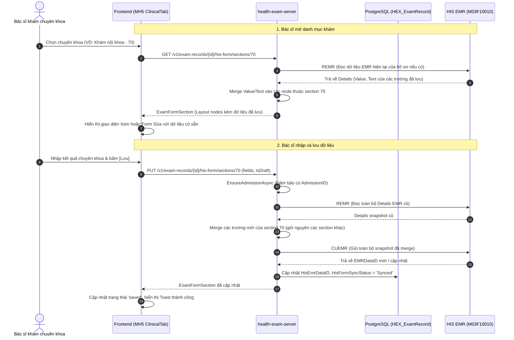

# Clinical HIS Form Value Persistence Design (MH5 Khám lâm sàng)

## 1. Bối cảnh & Vấn đề (Context & Problem Statement)

Trên màn hình **MH5 - Khám lâm sàng** (Tab Results):
- **Hiện tại:** Dữ liệu nhập của các chuyên khoa lâm sàng (`category.values`) đang được lưu tạm thời vào `localStorage` của trình duyệt (`window.localStorage` với key `health-exam:records` qua `kskRecordService`).
- **Hạn chế:**
  1. Dữ liệu chỉ nằm trên máy của người dùng, không được lưu xuống cơ sở dữ liệu hay HIS EMR.
  2. Bác sĩ ở chuyên khoa tiếp theo (hoặc mở hồ sơ trên máy tính khác) không thể thấy các kết quả do chuyên khoa trước đó đã nhập và lưu.
  3. Khi F5 hoặc xoá cache trình duyệt, dữ liệu kết quả khám lâm sàng có nguy cơ bị mất hoặc không đồng bộ với tiến trình khám thật trên HIS.

**Yêu cầu:** Khi bác sĩ nhập dữ liệu của một danh mục khám lâm sàng và bấm **[Lưu]**, dữ liệu phải được lưu trực tiếp lên Database & HIS EMR thông qua API Backend. Khi bất kỳ danh mục khám nào được mở ra, các dữ liệu đã lưu trước đó phải được nạp đầy đủ từ Backend.

---

## 2. Mục tiêu & Phạm vi (Goals & Scope)

### Mục tiêu:
1. **Backend (`health-exam-server`):**
   - Cung cấp endpoint `PUT /v1/exam-records/{recordId}/his-form/sections/{itemGroupId}` để lưu các giá trị của một phân đoạn khám lâm sàng.
   - Cơ chế **Read-Merge-Write**:
     - Tự động đảm bảo hồ sơ có lượt tiếp nhận HIS (`AdmissionID`) hợp lệ.
     - Đọc dữ liệu phiếu khám hiện tại từ HIS EMR (`ReadFormDataAsync` / `REMR`).
     - Bảo toàn toàn bộ dữ liệu của các nhóm khác (Tiền sử bệnh, Thể lực, các chuyên khoa khác).
     - Ghi đè/cập nhật các trường thuộc `itemGroupId` được gửi lên.
     - Gửi snapshot đầy đủ lên HIS EMR qua `_hisEmrApi.SaveFormDataAsync` (`POST /api/M03F10010/CUEMR`).
     - Cập nhật `HisEmrDataID` và trạng thái đồng bộ (`HisFormSyncStatus`) vào bảng `HEX_ExamRecord` trong PostgreSQL.
   - Nâng cấp endpoint `GET /v1/exam-records/{recordId}/his-form/sections/{itemGroupId}`:
     - Nếu hồ sơ đã có `HisEmrDataID` / `AdmissionID`, nạp dữ liệu từ HIS EMR và gán sẵn `Value` / `Text` tương ứng cho từng node của layout trước khi trả về Frontend.

2. **Frontend (`turbo-web`):**
   - Bổ sung method `saveRecordHisFormSection` trong `HealthExamHisFormService` (`packages/api`).
   - Bổ sung hook `useSaveExamRecordHisFormSectionMutation` (`apps/health-exam`).
   - Kết nối `CategoryPanel` và `ClinicalTab`:
     - Khi ấn **[Lưu]**, chuyển đổi `values` form sang format payload và gọi mutation lưu lên Backend.
     - Sau khi lưu thành công, invalidate React Query cache để nạp lại dữ liệu server, cập nhật trạng thái danh mục sang "Đang khám" / "Đã lưu" (`saved`) để hiển thị các nút `[Sửa]`, `[Ký số]`.
     - Loại bỏ việc ghi vào `localStorage` cho các danh mục khám HIS động.

### Phạm vi loại trừ (Out of Scope):
- Không thay đổi luồng ký số M02 (`SubmitEMR`, `SignEMR`) - luồng này đã có sẵn endpoint riêng.
- Không sửa đổi Tab Cận lâm sàng và Tab Kết luận.

---

## 3. Kiến trúc & Luồng dữ liệu (Architecture & Data Flow)

### 3.1 Sơ đồ luồng lưu và nạp dữ liệu (Sequence Diagram)



---

## 4. Chi tiết Hợp đồng API (API Contracts)

### 4.1 Lưu giá trị phân đoạn khám lâm sàng
- **Method:** `PUT`
- **Path:** `/v1/exam-records/{recordId}/his-form/sections/{itemGroupId}`
- **Request Body:**
```json
{
  "fields": [
    {
      "itemId": "3fa85f64-5717-4562-b3fc-2c963f66afa6",
      "value": "120/80",
      "text": "120/80 mmHg"
    }
  ],
  "isDraft": true
}
```
- **Response:**
```json
{
  "ErrorCode": 0,
  "Message": "Success",
  "Data": {
    "RecordId": "3fa85f64-5717-4562-b3fc-2c963f66afa6",
    "AdmissionId": 12345,
    "ItemGroupId": 70,
    "Layout": [ ... ]
  }
}
```

### 4.2 Lấy phân đoạn kèm giá trị đã lưu
- **Method:** `GET`
- **Path:** `/v1/exam-records/{recordId}/his-form/sections/{itemGroupId}`
- **Response:** `ExamFormSection` với mỗi node trong `Layout` có thuộc tính `Value` và `Text` được điền từ dữ liệu HIS EMR (nếu có).

---

## 5. Kế hoạch kiểm thử (Verification Plan)

1. **Backend Tests:**
   - Test unit/integration cho `HisExamFormGateway.SaveSectionAsync` và `HisExamFormGateway.GetSectionAsync`:
     - Kiểm tra việc bảo toàn các trường của section khác khi lưu một section.
     - Kiểm tra việc nạp lại dữ liệu đã lưu khi gọi `GetSectionAsync`.
     - Kiểm tra cập nhật `HisEmrDataID` trên `HEX_ExamRecord`.
   - Chạy `dotnet test` toàn bộ backend test suite.

2. **Frontend Tests:**
   - Test unit cho `useSaveExamRecordHisFormSectionMutation` và `CategoryPanel`:
     - Bấm [Lưu] kích hoạt gọi API `PUT` với payload chuẩn.
     - Hiển thị dữ liệu trả về từ server thay vì phụ thuộc `localStorage`.
   - Chạy `bun run --filter @medviet/health-exam test` và `typecheck`.
